# Instalación de Python 2.7.14 de 32 bits

Para el correcto funcionamiento de Kuorra es necesario instalar y configurar el sistema para poder ejecutar python desde cualquier carpeta, la versión que se recomienda utilizar es Python 2.7.14 de 32 bits, esta versión incluye PIP - Python Package Index (PyPI), lo que permitirá instalar Kuorra y todas las librerías necesarias para su ejecución.

1.- Descargar la versión de Python de 32 bits de la siguiente dirección:

https://www.python.org/downloads/release/python-2714/

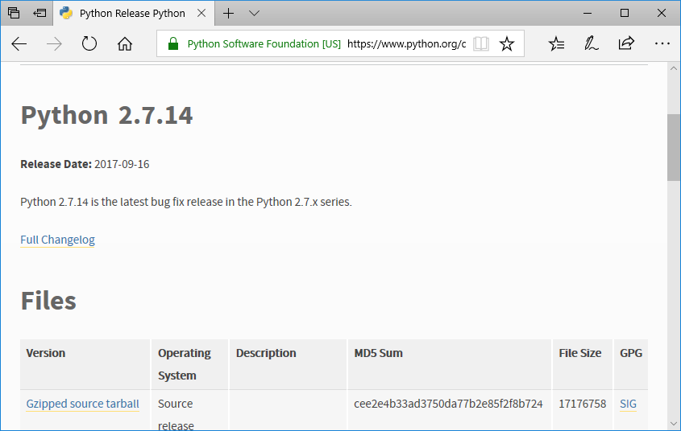

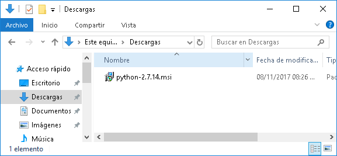

2.- Una vez descargado Python se realiza la instalación haciendo doble clic en el archivo MSI.

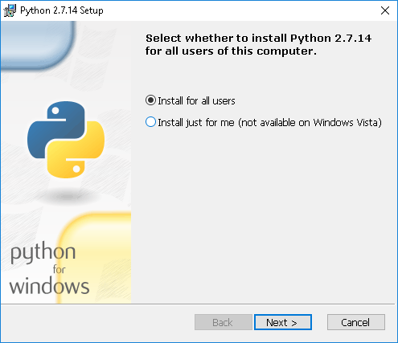

3.- En la ventana de configuración se elige donde se va a instalar Python, de forma automática se instala en C:\Python27\

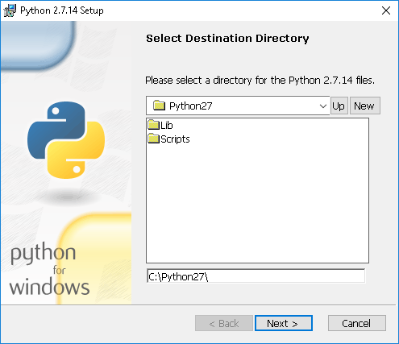

4.- En la ventana de personalización se agrega la opción de configurar automáticamente el Path para que el sistema reconozca el comando Python desde cualquier ubicación, como se puede apreciar en la Imagen 5, esta versión de Python ya incluye a PIP.

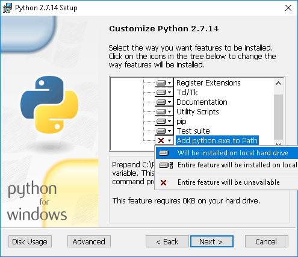

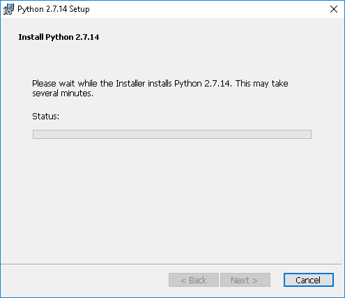

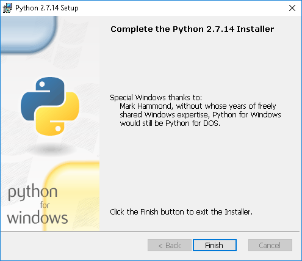

5.- Para verificar que la instalación y configuración del Path se realizo de forma exitosa se abre una terminal o línea de comandos y se escribe el siguiente comando

C:\python

Como se muestra en la Imagen 8 se abre el python shell desde donde ya es posible comenzar a programar.

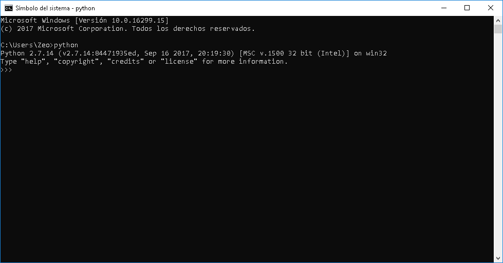

6.- Abrir el explorador de Windows y hacer clic derecho sobre el icono de “Este equipo”, ahí se selecciona propiedades, como se muestra en la Imagen 9.

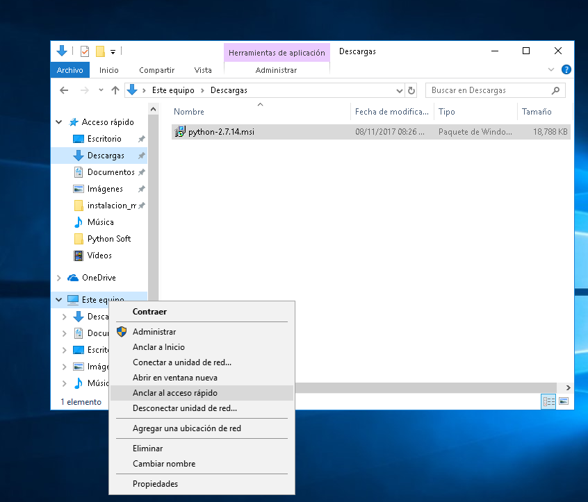

7.- En al ventana de propiedades del sistema hacer clic en “Configuración avanzada del sistema” como se muestra en la Imagen 10.

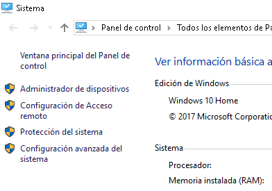

8.- En la ventana de “Propiedades del sistema” se hace clic en el botón Variables de entorno, como se muestra en la Imagen 11.

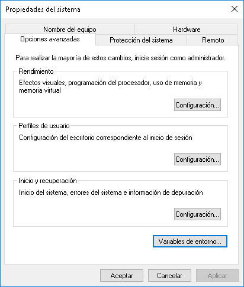

9.- Dentro de las variables de entorno se modifica o se agrega la variable Path, para esto hay dos partes, en Variables de usuario, lo que haría que esta solo funcionará para el usuario activo, en Variables del sistema funcionará para todos los usuarios del sistema, ambas opciones son validas, tómese como referencia la Imagen 12.

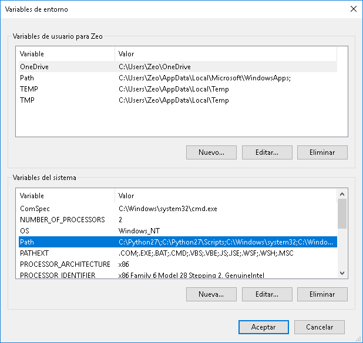

10.- En la variable Path agregar las siguientes rutas:

C:\Python27\

C:\Python27\Scripts

La segunda ruta permite que cuando se instale kuorra en el sistema, este pueda ser usado desde cualquier ubicación en el sistema. La variable debe quedar como se muestra en la Imagen 13.

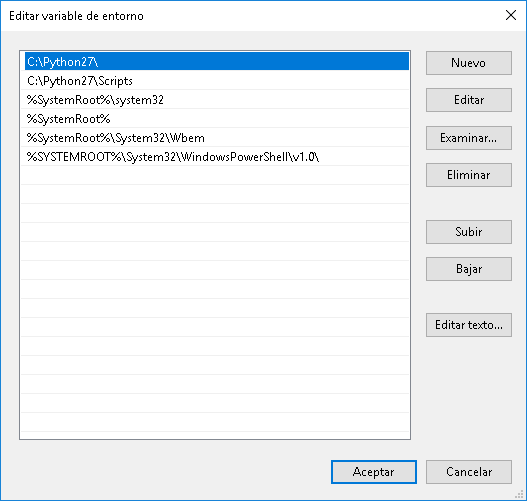

11.-Después de configurar el Path hay que hace clic en el todos los botones aceptar, posteriormente cerrar la línea de comandos si es que estuviera abierta para que los cambios sean aplicados. Comprobar como se muestra en el paso 5 que se pueda abrir el Python Shell en cualquier carpeta.

***

[Anterior](https://salvadorhm.github.io/kuorra/) | [Siguiente](https://salvadorhm.github.io/kuorra/k02)
